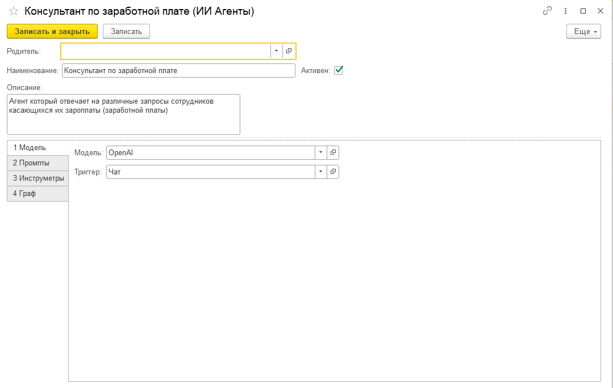

# Ключевые возможности

OneAPA предоставляет широкий набор возможностей для создания и эксплуатации ИИ агентов в корпоративной среде.

## Low-code разработка агентов

### Без программирования

Создание агента не требует написания кода:

1. Задайте **имя** и **описание** агента
2. Напишите **системный промпт** — инструкцию для LLM
3. Выберите **модель** (LLM провайдер)
4. Добавьте **инструменты** из готового набора
5. Настройте **триггер** запуска

### Визуальный интерфейс

<figure><figcaption></figcaption></figure>

## Поддержка множества LLM провайдеров

### Доступные провайдеры

| Провайдер      | Модели                | Особенности                               |
| -------------- | --------------------- | ----------------------------------------- |
| **Yandex GPT** | YandexGPT/latest      | Российский провайдер, соответствие ФЗ-152 |
| **OpenAI**     | GPT-4o, GPT-4, o1, o3 | Vision, Reasoning, web\_search            |
| **OpenRouter** | Любые модели          | Единый API к множеству провайдеров        |
| **Ollama**     | Llama, Mistral, и др. | Полностью локальные модели                |
| **Sber**       | GigaChat              | Российский провайдер                      |

### Особенности моделей

## MCP (Model Context Protocol)

### OneAPA как MCP сервер

Любой инструмент агента автоматически доступен через MCP, если установлена галка "Публиковать как MCP"

<figure><figcaption></figcaption></figure>

### OneAPA как MCP клиент

Подключение внешних MCP серверов:

* Файловая система
* GitHub
* Базы данных
* Любые MCP-совместимые сервисы

### Преимущества MCP

| Преимущество    | Описание                            |
| --------------- | ----------------------------------- |
| Универсальность | Единый протокол для всех интеграций |
| Расширяемость   | Легко добавлять новые инструменты   |
| Совместимость   | Работа с Cursor, Claude и другими   |

## Чат-интерфейс

### Встроенный чат в 1С

* Доступен из любого места конфигурации
* Поддержка прикрепления файлов
* История диалогов
* Выбор агента

### Web-интерфейс Chainlit

<figure><figcaption></figcaption></figure>

* Доступ через браузер
* Не требует клиента 1С
* Современный дизайн
* Поддержка мобильных устройств

### Возможности чата

| Возможность         | Описание                           |
| ------------------- | ---------------------------------- |
| Текстовые сообщения | Основной способ взаимодействия     |
| Файлы               | PDF, Excel, Word, изображения      |
| История             | Сохранение контекста диалога       |
| Мультиагентность    | Выбор агента для конкретной задачи |

## Интеграция с OneRPA

### Роботы как инструменты

<figure><figcaption></figcaption></figure>

Агенты могут запускать роботов OneRPA:

```
Пользователь: "Выгрузи отчёт по продажам за месяц в Excel"

Агент → вызов робота OneRPA "Выгрузка отчёта продаж"
      → робот формирует Excel файл
      → робот сохраняет файл в папку
      → агент получает результат

Агент: "Отчёт сохранён в папке D:\Reports\sales_2025_01.xlsx"
```

### Преимущества интеграции

* Использование существующих роботов
* Автоматизация сложных сценариев
* Работа с UI приложений (SAP, веб и др.)

## RAG (Retrieval-Augmented Generation)

### Что такое RAG

RAG позволяет агенту использовать внутренние базы знаний:

```
┌─────────────────┐         ┌─────────────────┐
│  Вопрос         │         │  Векторная БД   │
│  пользователя   │────────►│  (знания)       │
└─────────────────┘         └────────┬────────┘
                                     │
                            релевантные документы
                                     │
                                     ▼
                            ┌─────────────────┐
                            │      LLM        │
                            │  (генерация     │
                            │   ответа)       │
                            └─────────────────┘
```

### Выгрузка в векторную БД

Обработка APA\_ВыгрузкаВВекторнуюБД:

* Выгрузка данных 1С в векторную базу
* Поддержка различных типов данных
* Автоматическое обновление

### Использование

```
Пользователь: "Какова процедура оформления командировки?"

Агент → поиск в векторной БД
      → найдены релевантные документы
      → LLM формирует ответ на основе документов

Агент: "Согласно внутреннему регламенту компании, 
        процедура оформления командировки включает:
        1. Заполнение заявки в системе...
        2. Согласование с руководителем...
        ..."
```

## Триггеры запуска

### Типы триггеров

| Триггер            | Описание         | Пример                   |
| ------------------ | ---------------- | ------------------------ |
| **Чат**            | Сообщение в чате | Пользователь пишет в чат |
| **EMail**          | Входящее письмо  | Письмо на hr@company.ru  |
| **API**            | HTTP запрос      | POST /api/agent/invoke   |
| **Буфер обмена**   | Изменение буфера | Копирование текста       |
| **Запись объекта** | Событие в 1С     | При записи документа     |

### Примеры использования

#### Триггер EMail

```
Входящее письмо: "Нужна справка 2-НДФЛ за 2024 год"

Агент (кадровый) автоматически:
→ определяет отправителя
→ формирует справку
→ отправляет ответное письмо с вложением
```

#### Триггер "Запись объекта"

```
При записи документа "Заявление на отпуск":

Агент автоматически:
→ проверяет корректность заполнения
→ проверяет пересечение с другими отпусками
→ отправляет уведомление руководителю
```

## Безопасность

### On-Premise развёртывание

* Все компоненты работают в инфраструктуре заказчика
* Данные не покидают периметр организации
* При использовании Ollama — полная изоляция


## Далее

* [Быстрый старт](../bystryj-start/) — создание первого агента
* [Установка](/broken/pages/Q4ra8Wne8P6Nv47rT3MR) — подробные инструкции
