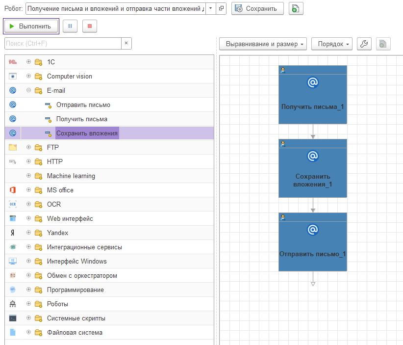

# Шаблоны E-mail

Шаблоны этапов для работы с электронной почтой выполняют важную функцию как в составе сложных роботов для получения файлов или другой информации, так и как самостоятельная единица для автоматизации рутинных и объемных работ с электронной почтой. Например: отправка списком коммерческих предложений для клиентов, или отправка пачек счетов на оплату, или автоматическое получение писем и их вложений, и многое другое.&#x20;

Для автоматизации работы с электронной почтой и ее вложениями, в платформе OneRPA существует три шаблона:

[Видео с примером тестового робота](https://files.gitbook.com/v0/b/gitbook-x-prod.appspot.com/o/spaces%2F-M6ZxAmaxODS4CigF0WD%2Fuploads%2Fn0aLeIU318duDOP0Cs4E%2F%D0%A0%D0%B0%D0%B1%D0%BE%D1%82%D0%B0%20%D1%81%20e-mail.mp4?alt=media\&token=3433577c-bb74-4ade-b56f-075ae60e850e), демонстрирующего работу всех трех шаблонов этапов вместе.

* [Получить письма](shablony-e-mail/poluchit-pisma.md)
* [Отправить письмо](shablony-e-mail/otpravit-pismo.md)
* [Сохранить вложения](shablony-e-mail/sokhranit-vlozheniya.md)

