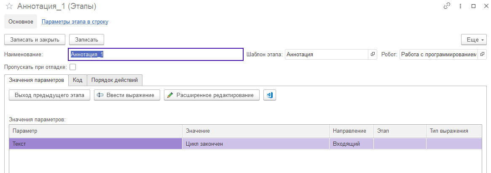

# Аннотация

Чтобы вывести служебное сообщение пользователю о критичных момента в ходе выполнения робота существует шаблон этапа "Аннотация". Например, что выполнение цикла завершено, условие не отработало или вызвано исключение.

Данный шаблон прост. Имеет только один параметр, текст сообщения, который будет выведен пользователю.
