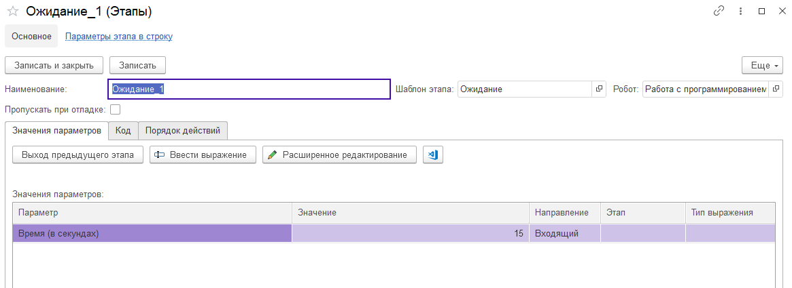

# Ожидание

Данный шаблон этапа необходим для принудительной задержки в выполнении робота. Возможно, для получения данных, или ожидания загрузки файла, или полной загрузки окна браузера и  во многих других случаях. Шаблон имеет единственный параметр: время паузы в секундах.&#x20;
