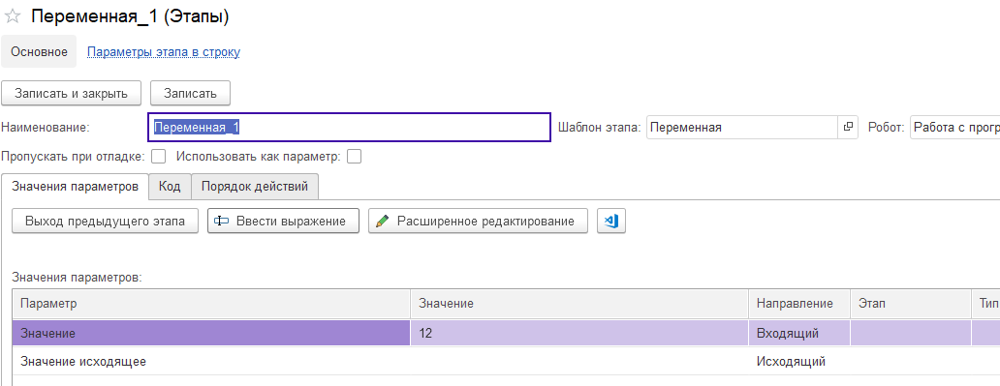

# Переменная

Шаблон этапа "Переменная" позволяет вычислить значение переменной и передать его на вход другого этапа. Обычно это числовое значение, строка или дата. Переменная важна при работе с условиями: может служить триггером. При работе с циклами: может быть итератором цикла. Шаблон содержит следующие параметры:

* Значение. Здесь вычисляется или вводится некое значение.
* Значение исходящее. Вычисленная переменная передается на вход другого этапа.
