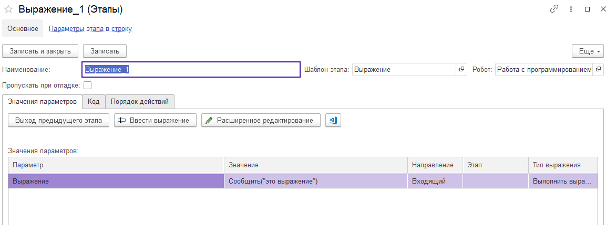

# Выражение

Шаблон этапа "Выражение"  позволяет выполнить выражение на языке 1С. Обычно это небольшой блок кода, выполняющий некую операцию. Но НЕ возвращающий значение, как это делает функция. Например, мы можем вывести сообщение пользователю. Шаблон содержит единственный параметр:

* Выражение. Строка кода на языке 1С
