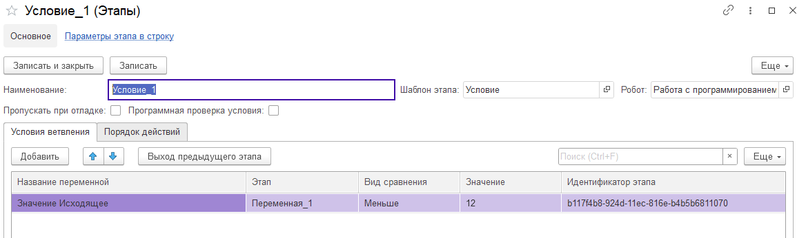

# Условие

Шаблон этапа "Условие" необходим для обработки случаев, когда у переменной возможны  только 2 значения Истина или Ложь.  На первой вкладке "Условия ветвления" указывается собственно само условие. Выбирается этап и исходящий параметр этого этапа, который будет сравниваться по нужному нам виду сравнения и проверятся на истинность. К примеру, у нас есть переменная. В ходе выполнения робота, она принимает некое значение. И здесь  мы ее сравниваем   с определенным значение. Например, нас интересует, меньше или больше переменная 12. Если меньше, то выполнится одна ветка алгоритма. Если больше или равна 12, то другая ветка алгоритма.
