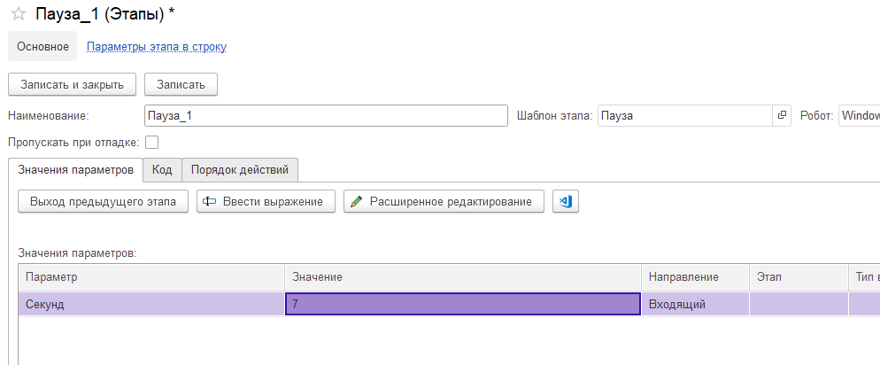

# Пауза

Этот шаблон этапа необходим для установки времени задержки в выполнении робота. Задержка может быть необходима, чтобы дождаться, когда полностью прогрузится страница в браузере или приложение закончит выполнение операции. Шаблон имеет единственный параметр:&#x20;

Секунд. Количество секунд, насколько нужно сделать задержку в исполнении робота.&#x20;
